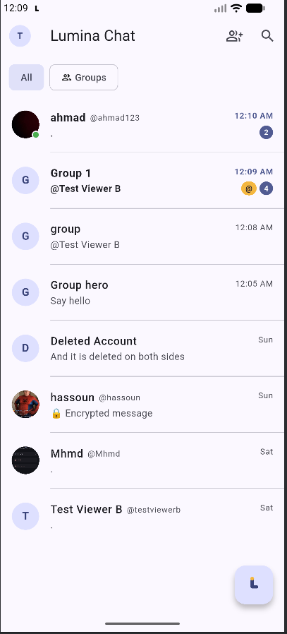
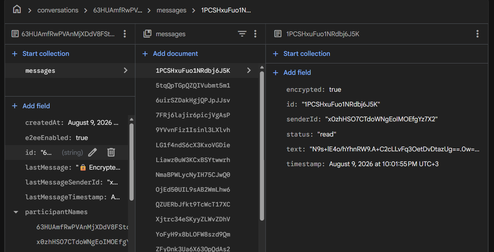

# Lumina Chat

A real-time Android messaging app built with Flutter and Firebase — direct messages and group chats, media/voice messages, translation, push notifications, and a built-in AI assistant, all on free-tier infrastructure.

**Why "Lumina"?** Communication is about bringing people closer and making conversations clearer — Lumina represents light, connection, and a bright space for people to communicate. The brand mark (an L built from a glowing bar and a spark) carries that through the launcher icon, splash screen, and in-app touches.

## Status: Version 1.0

Feature-complete and tested end-to-end against the live Firebase project on both an emulator and a physical device. See `reports/` for the full day-by-day build history, including bugs found and how they were fixed, or **[reports/FINAL-REPORT.md](reports/FINAL-REPORT.md)** for the single-document summary of every feature, the architecture, and known limitations.

Want to try it without building it yourself? Grab the APK from this repo's [Releases](../../releases) page.

## Screenshots & Demo

 

*The second screenshot is proof, not a mockup: a real message document in the Firebase Console, with `encrypted: true` and `text` holding ciphertext rather than readable content — see [Security: Basic E2EE MVP](#security-basic-e2ee-mvp).*

- [Demo walkthrough (video)](screenshots/demo-walkthrough.mp4)
- [Demo walkthrough — part 2 (video)](screenshots/demo-walkthrough-2.mp4)

## Features

**Messaging**
- Real-time 1:1 and group conversations, with read/delivered receipts and presence (online/last seen)
- Text, image, and voice messages; reply, edit, delete (for me / for everyone), forward
- Emoji reactions and an in-app emoji picker
- Automatic message translation (tap-to-translate, per-message, into your preferred language)
- Clear chat / delete chat (per-user, non-destructive to the other participant)
- Typing indicators (self-healing — clears automatically if a "stopped typing" signal is never sent)
- @mentions in group chats, with autocomplete, highlighted rendering, and a dedicated unread-mention badge on the conversation list

**Groups**
- Create a group with a name and photo, add members at creation or later
- Remove a member (admin/creator only) and leave a group (any member, including the creator)
- Sender names on incoming group messages; full feature parity with 1:1 chats

**Security**
- Basic end-to-end encryption for 1:1 text chats (opt-in, toggled per conversation) — see [Security: Basic E2EE MVP](#security-basic-e2ee-mvp) below for exactly what is and isn't protected

**AI Assistant**
- A floating-button entry point to a dedicated assistant chat
- Answers general questions like any AI assistant, and answers "how do I…" questions about Lumina Chat itself, grounded in the app's actual current features (not invented)

**Account & Profile**
- Email/password auth with email verification, session persistence
- Google Sign-In (alongside email/password)
- Username system (claim + edit, race-safe uniqueness), display name, profile photo
- Self-service account deletion with full cleanup (Firestore, Realtime Database, Auth)
- Settings: Light/Dark/System theme, preferred language

**Notifications**
- Push notifications for new messages, sent client-side (no server, no Cloud Functions)

## Security: Basic E2EE MVP

Lumina Chat includes an **opt-in, basic end-to-end encryption MVP** for 1:1 text chats — this is a small demonstration implementation, not a production-grade Signal-style protocol, and is documented here honestly rather than oversold:

**What is actually encrypted:**
- Text messages in 1:1 (non-group) conversations, sent *after* encryption is enabled for that conversation
- Uses X25519 (ECDH key exchange) + AES-256-GCM (authenticated encryption), via the well-established Dart `cryptography` package — no custom/invented cryptography
- Firestore stores only ciphertext for these messages; the message preview shown in push notifications and the conversation list is a generic "New encrypted message" / "🔒 Encrypted message", never the real text

**What is NOT encrypted:**
- Group chats, images, voice messages, reactions, and all messages sent before encryption was enabled for a conversation
- Translation is unavailable for encrypted messages (translating would require sending plaintext to the server)

**Where keys are stored:**
- Each device generates its own X25519 key pair on first use; the private key is stored only in `flutter_secure_storage` (Android Keystore-backed), never leaves the device, and is never written to Firestore
- Only the public key is published to Firestore, under the user's own document, so the other participant can derive a shared secret

**Known limitations (by design, given the MVP scope):**
- No forward secrecy or key rotation — a single long-lived key pair is used for the life of the install
- No multi-device support — a second device generates a separate key pair, which will not match past conversations
- No key-verification UI (no safety numbers/QR comparison), so this does **not** protect against a malicious server substituting a public key in a man-in-the-middle position — it protects against the server (or anyone else) passively reading message content in transit/at rest, not against an active MITM at the key-exchange step
- No account-recovery story: if the device's secure storage is cleared, past encrypted messages on that device become undecryptable

This should be described as a **Basic E2EE MVP**, not production-grade encryption.

## Architecture

Feature-first structure (`lib/features/<feature>/{data,presentation}`), repository pattern, Riverpod for state/DI, GoRouter for navigation. Everything runs on **free-tier services only** — no paid Firebase plan, no dedicated backend server:

| Concern | Service | Why |
|---|---|---|
| Auth, database, presence | Firebase Auth, Cloud Firestore, Realtime Database | Free (Spark) tier |
| Media (photos, voice messages) | ImageKit | Firebase Storage requires the paid Blaze plan |
| ImageKit upload signing | Cloudflare Worker | Keeps ImageKit's private key out of the app |
| Translation + AI Assistant | Gemini, via a Cloudflare Worker | Keeps the Gemini API key out of the app; both features share one Worker, dispatched by request shape |
| Push notifications | Cloudflare Worker → FCM | Client-triggered after a message send succeeds — no polling, no Cloud Functions |

Each Cloudflare Worker's source lives in `cloudflare-worker/` and is deployed by pasting it into the Cloudflare dashboard (no build tooling needed) — see the comment block at the top of each file for exact deploy steps.

## Repository Layout

- `lib/` — the Flutter app (feature-first: `lib/features/<feature>/{data,presentation}`, shared code in `lib/core/`)
- `android/` — native Android project (launcher icon, splash, manifest)
- `cloudflare-worker/` — source for the three Workers described above
- `docs/` — original product requirements, architecture decisions, data model, design system notes
- `reports/` — day-by-day build reports: what shipped, what broke, how it was fixed, verified against the real backend (see `reports/FINAL-REPORT.md` for the summary)
- `prompts/` — AI prompts used during development
- `cv/` — the developer's CV

## Running it

1. `flutter pub get`
2. Firebase: this repo's `lib/firebase_options.dart` and `android/app/google-services.json` point at the project's own Firebase project (Spark/free tier) — swap in your own via `flutterfire configure` to run against a different project.
3. Deploy the three Cloudflare Workers in `cloudflare-worker/` (see each file's header comment) and set their secrets (ImageKit private key, Gemini API key, Firebase service account JSON). Update the corresponding endpoint constants in `lib/core/config/` if your Worker URLs differ.
4. `flutter run`

## Known Limitations

- Sending an image with no network connectivity can leave it stuck "sending" instead of failing fast with a retry prompt — open, documented in `reports/day-04-05-status-report.md`.
- The AI Assistant's conversation history is in-memory only for the current app session (not persisted).
- Group chat rename, changing a group's photo after creation, and promoting a new admin are intentionally not built yet (the data model already has room for them).
- The debug/release APK is currently signed with a debug key (no dedicated release keystore) — fine for sideloading to testers, not for a Play Store submission as-is.
- E2EE is a Basic MVP — see [Security: Basic E2EE MVP](#security-basic-e2ee-mvp) for its specific, documented limitations (no forward secrecy, no key rotation, no multi-device support, no MITM protection).

## What's Next (under consideration, not started)

Pinned messages, file/document sharing, voice calls, video calls, call history, voice message transcription, advanced group administration, and further AI Assistant capabilities. None of these are scoped or scheduled yet — v1.0's priority remains real-world testing and feedback before adding anything new.
